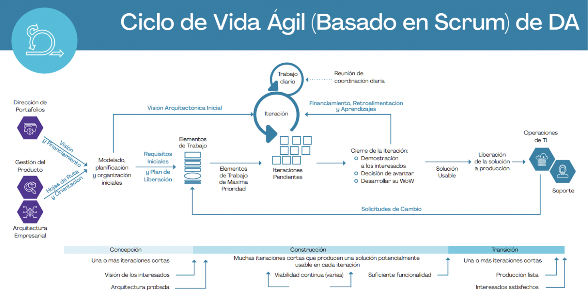
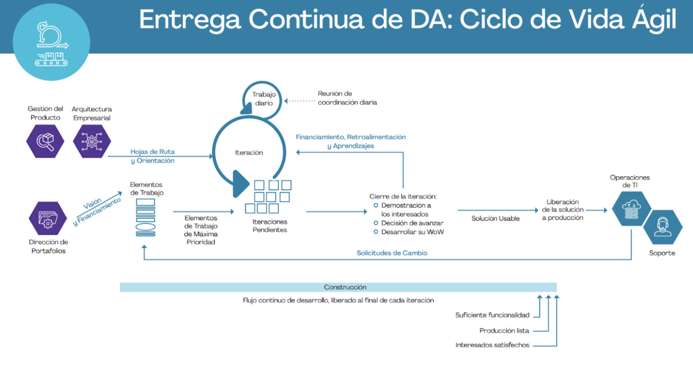

# Forma de trabajo - Espresso

## Roles de liderazgo

- Product Owner: [Adolfo Acosta Castro](mailto:a01705249@tec.mx)
- Team Leader: [Juan Manuel Amador Pérez Flores](mailto:a01701248@tec.mx)
- Architecture Owner: [Sebastián González Tafoya](mailto:a01233416@tec.mx)

[Aquí](https://docs.google.com/spreadsheets/d/1naF2ckYlDvAIQoa3ptkEfBDong-dnMHzKCRtS0vz6x8/edit#gid=0) se encuentra un historial de los roles de liderazgo y las rotaciones de los mismos dentro del departamento Taro.

## Responsabilidades del equipo

Fase Inicial

[Matriz RACI](https://docs.google.com/spreadsheets/d/138hOit4VKnIF8iJlYP9AAkDv1ZDCaNug5S_VPua2ICQ/edit#gid=0)

## Juntas

Juntas internas del equipo

Juntas con Casa Medio Camino

## Canales de comunicación

Internos del equipo

El medio principal de comunicación será Slack, específicamente en el canal: #taro-medio-camino

Con el socio formador

Además de las juntas por medio de zoom, se tiene un grupo de WhatsApp con nuestros contactos en la organización.

## Proceso de Desarrollo

El equipo trabajará utilizando el ciclo de vida ágil de DA, por lo menos hasta desarrollar un MVP. Una vez logrado esto, el equipo desarrolla las habilidades técnicas de integración continua y migrará al ciclo de vida de entrega continua ágil de DA.

## Acuerdos específicos

- El Product Owner es el principal encargado de dirigir las juntas con los socios.
- Un miembro del equipo recuerda a los socios de asistir a las reuniones 10 minutos antes de la hora de inicio por medio de un mensaje de WhatsApp.
- Un miembro del equipo recuerda a los socios de las reuniones que se agendaron para una semana el viernes anterior por medio de un mensaje de WhatsApp.
- Un miembro del equipo recuerda a los socios de las reuniones que se agendaron para cada día al inicio del día de la reunión.
- Hay dos miembros del equipo fijos para llevar las minutas de las reuniones con los socios.
- Hay dos miembros del equipo, distintos de los del punto anterior, para llevar las minutas de las reuniones del equipo.
- Los encargados de llevar la minuta en una reunión agregan los compromisos y work items que surjan durante todas las reuniones a la herramienta de seguimiento de tareas.

## Bitácora de cambios

### Versión 1.0

- Se registro la forma de trabajo en la Wiki
