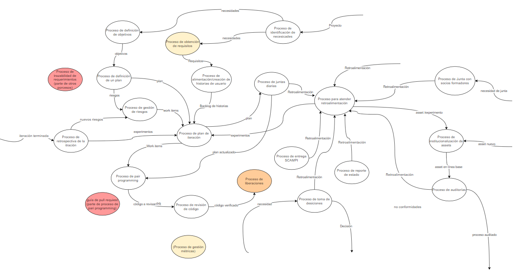
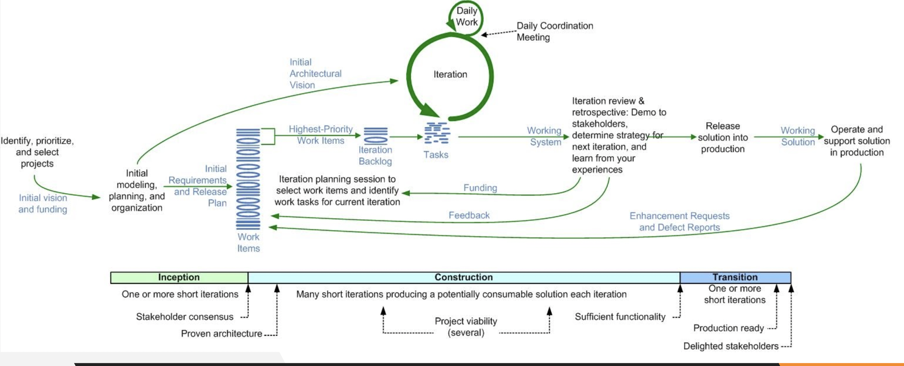

# Forma de trabajo - Taro

### Objetivo:

Que los miembros de Taro tengan una forma de trabajo definida que apoye a la creación de soluciones de software que cumplan con estándares de calidad de nivel internacional.

### Políticas:

**Marcos de referencia:**

El trabajo del departamento se apoya en los siguientes marcos de referencia:

- [Disciplined Agile Delivery](https://www.pmi.org/disciplined-agile/process/introduction-to-dad)
- [CMMI for development](https://cmmiinstitute.com/cmmi/dev)
- [PMBoK](https://www.pmi.org/pmbok-guide-standards)

Se recomienda ampliamente seguir los siguientes libros para tenerlos como referencia y guía

<ol>
<li>Choose Your WoW : A Disciplined Agile Delivery Handbook for Optimizing Your Way of Working - Scott Ambler & Mark Lines</li>
<li>Project Management For The Unofficial Project Manager - Kory Kogon , Suzette Blakemore & James Wood</li>
<li>Introduction to the Team Software Process - Watts Humphrey</li>
</ol>

**Forma de trabajo:**

Cada equipo dentro del departamento deberá de gestionar su propio trabajo y deberá definir los siguientes puntos:

- Roles.
- Horarios de trabajo.
- Guías, plantillas y otros documentos de apoyo.
- Procesos.

**Planeación del proyecto**

De tal forma que Taro mantenga un estándar, la forma de trabajo para los proyectos se dará de la siguiente manera:

- Tener [juntas de coordinación diarias](./procesos/P07-proceso-juntas-diarias) las cuales permitirán al equipo actualizar el estado del proyecto y poder mejorar la forma de trabajo, se pueden utilizar las preguntas guía para identificar puntos importantes (¿Dónde estamos?¿Dónde deberíamos estar?¿Cuánto nos ha costado?).
- La [gestión](./procesos/P10-proceso-de-trazabilidad-de-requerimiento) y [toma de requisitos](./procesos/P05-proceso-requisitos) de un proyecto deberá estar definida, incluyendo un control de cambios de los mismos en donde se pueda mantener la trazabilidad.
- Realizar inspecciones de código frecuentes para asegurarse que la implementación cumpla con los estándares establecidos por el equipo, y encontrar defectos para que puedan ser corregidos y mitigados.
- [Definir correctamente el WBS](./guias/G07-guia-wbs) y actualizarlo constantemente para poder
- Definir los [criterios para finalizar](./checklists/CH04-checklist-definition-of-done) un requisito funcional, para tener claro lo que se tiene que cumplir antes de dar por terminado un requisito.

Como departamento cada equipo estimará los tamaños de los items usando "Agile Points" las cuales se regirán por los siguientes lineamientos

Se determinará el numero (1, 3, 5, 8, 13, etc.) siguiendo la técnica de Fibonacci teniendo cada una la siguiente escala

- 1: Una tarea donde hay conocimiento para realizarla y su dificultad es considerada fácil.
- 3: Una tarea donde no hay o hay poco conocimiento previo para realizarla y su dificultad es considerada fácil.
- 5: Una tarea donde no hay o hay poco conocimiento previo para realizarla y su dificultad es considerada media.
- 8: Una tarea en la que existe poco o mucho conocimiento previo para realizarla y su dificultad es considerada alta.
- 13: Una tarea en la que no hay conocimiento previo para realizarla y su dificultad es considerada muy alta.

Para poder estimar el costo de cada ítem se utilizará un sistema basado en horas en donde cada punto ágil equivale a una hora de trabajo.

## Mapa de procesos

Nuestro mapa de procesos se encuentra [aquí](https://drive.google.com/file/d/1DvFDwbp8PZt1BbRoPlbEJsgMrf43-qhj/view?usp=sharing).

La versión más reciente se ve así:

## Ciclo de vida DAD

En **Taro** utilizamos el ciclo de vida DAD Básico definido en la siguiente imagen:  

## Bitácora de cambios

### Versión 1.0
- Se creó la forma de trabajo.

### Versión 1.1
- Dejó de ser una política a ser su propio apartado.
- Se corrigieron errores de ortografía.

### Versión 1.2
- Se actualizó la imagen del mapa de procesos.
- Se agregó la liga para la DoD checklist.

### Version 1.3
- Se agregó la sección del ciclo de vida DAD Básico
