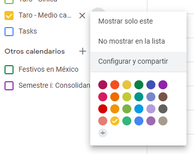
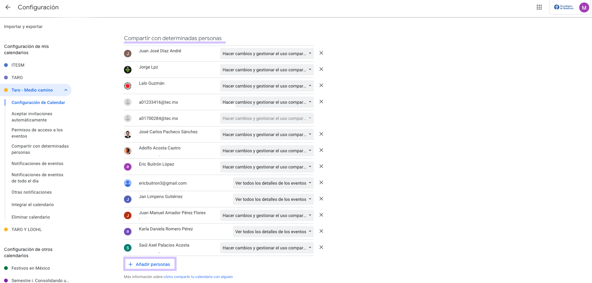
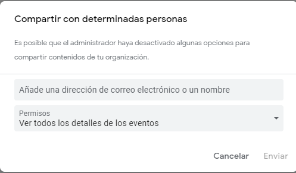
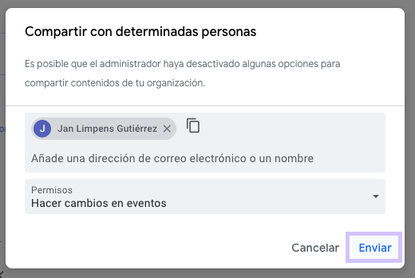
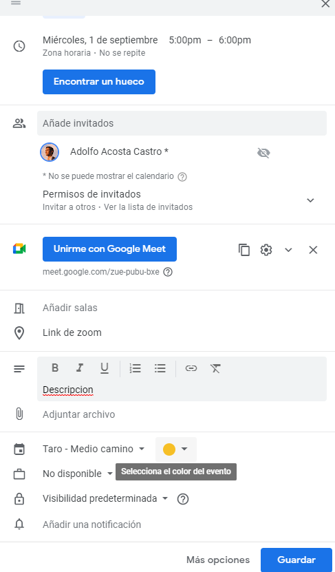

# G01 - Guía para agendar juntas

## Objetivo(s)

- Orientar en la creación y toma de decisión de fechas de un evento departamental dentro del calendario oficial y recreativo de Taro, esto incluye los calendarios:
  <ul><li>Académicos (semestre i)</li><li>Departamentales</li><li>Equipos correspondientes</li></ul>

- Organizar de manera visual y ordenada todos los eventos para mejorar la organización y planeación personal de cada integrante del departamento, permitiendo una mayor participación en todos los eventos.

## Pre-requisitos

Contar con las plantillas:

- Contar con acceso al calendario virtual [Académico (Semestre i)](https://calendar.google.com/calendar/embed?src=itesm.mx_jd61cv3hbbmtuiib93un8s2lok%40group.calendar.google.com&ctz=America%2FMexico_City)
- Contar con acceso al calendario virtual [Departamental](https://calendar.google.com/calendar/embed?src=c_fprk5lfepv1dslipu1dv1let2c%40group.calendar.google.com&ctz=America%2FMexico_City)
- Contar con acceso al calendario virtual por Equipos ( [Frappé](https://calendar.google.com/calendar/embed?src=c_8s7cshndqlge2j7bbbnk6g5tbo%40group.calendar.google.com&ctz=America%2FMexico_City) o [Espresso](https://calendar.google.com/calendar/embed?src=c_i6eeag7cqgta7spmhe8iuv3p78%40group.calendar.google.com&ctz=America%2FMexico_City) )

:::note

En caso de no contar con acceso a los calendarios se deberán seguir los pasos presentados a continuación, de lo contrario ir a la sección "Norma para los eventos".

:::

## Pasos a seguir

### Pedir acceso al calendario virtual

<ol>
<li> Ingresa a Google Calendar: Verás una pantalla parecida a esta.</li>

<li>Pasa el mouse por encima del nombre del calendario que quieres compatir y da clic en el icono de opciones (⋮). Aparecerá el siguiente menú desplegable, donde tendrás que dar clic en "Configurar y compartir".</li>

<li>En la pantalla "Configuración", navegar a la sección "Compartir con determinadas personas" y dar clic en el botón "+ Añadir personas".</li>

<li>En el modal de "Compartir con determinadas personas", ingresar el correo del usuario o usuarios con quién quieres compartir el calendario y seleccionar del dropdown los permisos que se le otorgarán a estos. </li>

<li>Dar clic en el botón de "Enviar", aparecerá un mensaje al pie de la ventana "Se han guardado las opciones para compartir."</li>

</ol>

### Norma para los eventos

- Se deberá poner un título descriptivo con la razón objetivo del evento.
- Se especificará la fecha y rango de horas para el evento.
- En caso de contar con los correos de los participantes, agregarlos para poder enviar una invitación de manera automática.
- En caso de usar una sala virtual se deberá verificar la disponibilidad de los links:
  
<ol><li>Taro General - https://itesm.zoom.us/j/84214225212 </li><li>Frappé -  https://itesm.zoom.us/j/84214225212
  </li><li>Espresso -  https://itesm.zoom.us/j/84321494768
  </li></ol>

- Agregar una descripción y los puntos claves a tocar en ese evento en la sección "Descripción".
- Seleccionar el calendario virtual en el que se colocará, ya sea Taro, Cínica o Medio Camino.
- Opcionalmente se puede agregar una notificación de recordatorio.

:::note

En el caso de Frappé, los calendarios de disponibilidad de la semana se enviarán el domingo previo a la semana de trabajo.

:::

## Salidas

- Junta agendada en el calendario correspondiente.

## Autores

- José Carlos Pacheco Sánchez

## Auditoría

- Eric Buitrón López
- Karla Daniela Romero Pérez
- María de los Ángeles Contreras Anaya

# Bitácora de cambios

## Versión 1.1
  - Se hicieron cambios en la redacción de pasos y con un lenguaje más apropiado.
  - Se cambiaron algunas imágenes para hacer más intelegible la guía.
  - Se corrigieron errores de ortografía.

## Versión 1.0
  - Se creó la guía.
