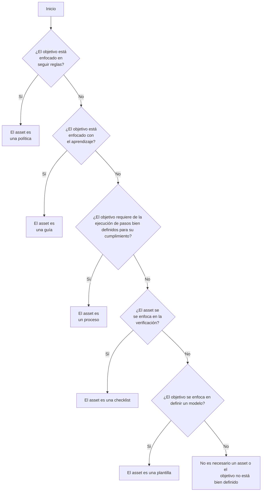

# G02 - Guía para la definición de assets

## Objetivo(s)

- Diferenciar entre los tipos de assets departamentales.

- Definir la categoría y el título de un asset que se este creando.

## Pre-requisitos

- Tener el objetivo del asset que se quiere crear definido.

### Árbol de decisiones

:::info

El árbol de decisiones fue creado con [mermaid](https://mermaid-js.github.io/mermaid/#/README) y [mdx-mermaid](https://github.com/sjwall/mdx-mermaid)

:::

### Características de los assets

#### Procesos
- Establece los pasos que se deben de ejecutar de manera sistemática para llegar a un resultado específico.
- Siempre se ejecutan de la misma manera y en el mismo orden.
- Artefacto donde se definen las prácticas del CMMI para cumplir con determinados estándares.
- El resultado de su ejecución siempre es el mismo y sirve como entrada de otros procesos. 

#### Guías
- Se enfocan en el aprendizaje.
- Si llegan a incluir pasos estos son sugerencias de mejores prácticas.
- Sirven como un recurso de apoyo para la realización de tareas específicas dentro de los procesos.
- Otorga a los usuarios libertad en su interpretación, implementación o uso.

#### Políticas
- Reglas estrictas que deben cumplirse por todos los integrantes de Taro.
- Respaldan la misión, visión y los objetivos del departamento.

#### Plantillas
- Modelo base para la construcción de algún artefacto que debe seguir un formato establecido.

#### Checklists
- Sirve para verificar el cumplimiento de un listado de elementos para asegurar la calidad de los artefactos.

### Cómo nombrar un asset

El identificador del título de un asset se define de acuerdo a la siguiente tabla:

| Tipo de asset | Prefijo | Ejemplo |
|---------------|:-------:|---------|
| Proceso | P | P05 |
| Guía | G | G10 |
| Política | POL | POL01 |
| Plantilla | PL | PL02 |
| Checklist | CH | CH15 |

:::tip

Para saber cuál es el siguiente número de identificador disponible para un artefacto, puedes visitar la [matriz de configuración](https://docs.google.com/spreadsheets/d/13zfQpqBBmqAT_znf1N4ebV_jcLBpeh_gjq9eHpkdOhk/edit#gid=0) de la línea base pertinente.

Por ejemplo, el identificador de la siguiente política al momento de escribir esta sección debería ser POL07.

:::

## Salidas

- La categoría y el identificador del artefacto que se está creando.

## Autores

- Eric Buitrón López (basándome en esta [guía](https://impulse-semestrei.github.io/guias/Guadecreacindeprocesos.html) de otro departamento de semestre i)
- María de los Ángeles Contreras Anaya

## Auditoría

- José Carlos Pacheco Sánchez
- Iván Alejandro Díaz Peralta
- Karla Daniela Romero Pérez
- Eduardo Andrés Castillo Perera

# Bitácora de cambios
## Versión 2.0
  - Se refactorizó la guía.
## Versión 1.0
  - Se creó la guía.
