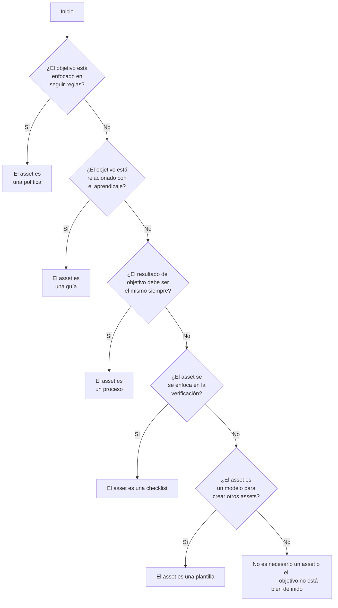
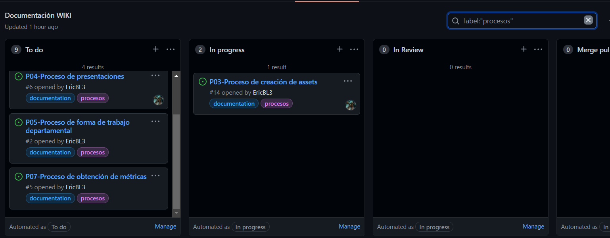

# G02 - Guía para la Definición de Assets

## Objetivo(s)

- Diferenciar entre los tipos de assets departamentales.

- Definir la categoría y el título de un asset que se este creando.

## Pre-requisitos

- Tener el objetivo del asset que se quiere crear definido.

## Pasos a seguir

### Árbol de decisiones

:::info

El árbol de decisiones fue creado con [mermaid](https://mermaid-js.github.io/mermaid/#/README) y [mdx-mermaid](https://github.com/sjwall/mdx-mermaid)

:::

### Características de los assets

#### Procesos

- Los resultados son replicables.
- Se ejecuta de la misma manera siempre y en el mismo orden.
- Tiene pre-requisitos, salidas y procedimientos específicos.
- Sigue un formato específico.

#### Guías

- Enseña a hacer algo.
- Tiene recomendaciones y pasos a seguir.
- Puede no ejecutarse de la misma manera siempre.

#### Políticas

- Reglas estrictas que deben seguirse.

#### Plantillas

- Es un modelo que se utiliza para construir algún otro asset.

#### Checklists

- Sirve para verificar el cumplimiento de un listado de requisitos.

### Cómo nombrar un asset

El identificador del título de un asset se define de acuerdo a la siguiente tabla:

| Tipo de asset | Prefijo | Ejemplo |
|---------------|:-------:|---------|
| Proceso | P | P05 |
| Guía | G | G10 |
| Política | POL | POL01 |
| Plantilla | PL | PL02 |
| Checklist | CH | CH15 |

:::tip

Para saber cuál es el siguiente número de identificador disponible para un asset, se puede hacer un filtrado por label de acuerdo al nombre del asset en el [tablero de la wiki](https://github.com/Taro-IT/docs/projects/1).

Por ejemplo, el identificador del siguiente proceso al momento de escribir esta sección debería ser P08.

:::

## Salidas

- La categoría y el título del asset que se está creando.

## Autores

- Eric Buitrón López (basándome en esta [guía](https://impulse-semestrei.github.io/guias/Guadecreacindeprocesos.html) de otro departamento de semestre i)

## Auditoría

- José Carlos Pacheco Sánchez
- Iván Alejandro Díaz Peralta
- Karla Daniela Romero Pérez
- Eduardo Andrés Castillo Perera
- María de los Ángeles Contreras Anaya

# Bitácora de cambios

## Versión 1.0
  - Se creó la guía.
