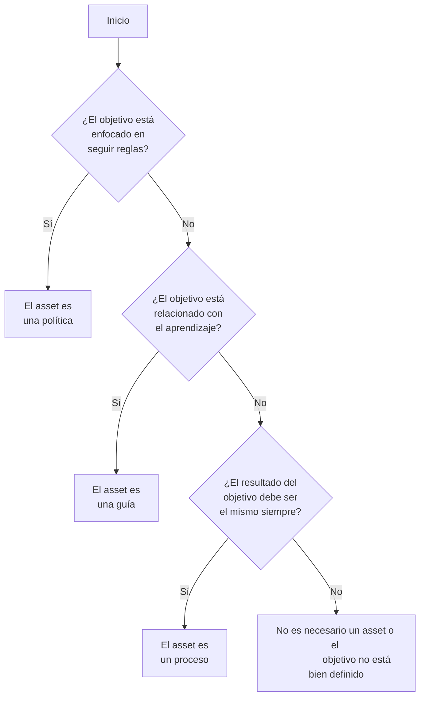

# Guía para la Definición de Assets

## Objetivo

**Principal:** Diferenciar entre los 3 tipos de assets: procesos, guías y políticas.

**Secundario:** Definir la categoría de un asset que se este creando.

## Pre-requisitos

 -Tener el objetivo del asset que se quiere crear definido.

## Pasos a seguir

### Árbol de decisiones

:::info

El árbol de decisiones fue creado con [mermaid](https://mermaid-js.github.io/mermaid/#/README) y [mdx-mermaid](https://github.com/sjwall/mdx-mermaid)

:::

### Características de los assets

#### Procesos

- Los resultados son replicables.
- Se ejecuta de la misma manera siempre y en el mismo orden.
- Tiene pre-requisitos, salidas y procedimientos específicos.
- Sigue un formato específico.

#### Guías

- Enseña a hacer algo.
- Tiene recomendaciones y pasos a seguir.
- Puede no ejecutarse de la misma manera siempre.

#### Políticas

- Reglas estrictas que deben seguirse.

## Salidas

- La categoría del asset que se está creando.

## Autores

- Eric Buitrón López (basándome en esta [guía](https://impulse-semestrei.github.io/guias/Guadecreacindeprocesos.html) de otro departamento de semestre i)

## Auditoría

-
