# Guía para Revisar Assets propuestos para la Wiki

## Objetivo

**Principal:** Entender cómo se realiza la revisión de un pull request de assets para la wiki.

## Pre-requisitos

- El pull request del asset debe estar en la columna **In Review** en el tablero de la Documentación WIKI.
  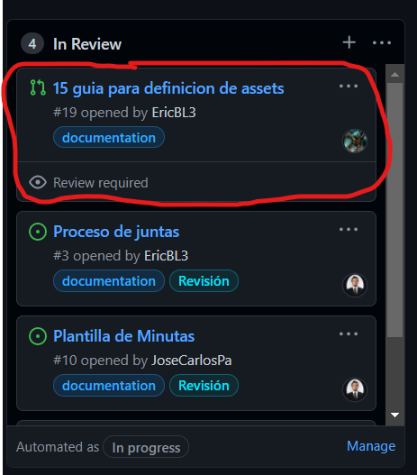

## Pasos a seguir

### Flujo para hacer la revisión

1. Abrir el pull request dando clic en las flechas marcadas en la imagen.

   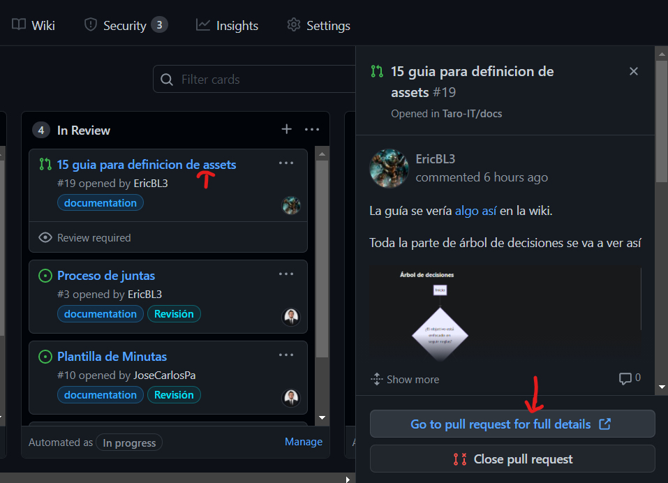

2. Encontrar el comentario con la versión más reciente del asset propuesto en el tab **Conversation**. El comentario tendrá una liga donde se puede ver el preview del asset y puede llegar a tener imágenes para mostrar cosas que sólo se verán bien cuando se haga el deploy.

3. Revisar el asset prestando atención a la ortografía y asegurarse de que cumpla con el objetivo propuesto.

4. Ir al tab de **Files Changed**

    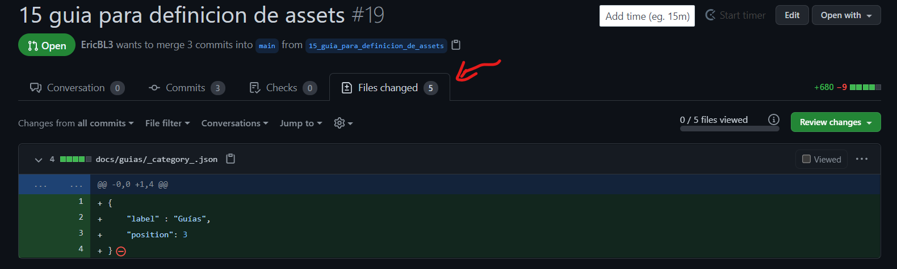

5. Hacer los [comentarios](#cómo-hacer-comentarios-para-un-archivo) y/o [modificaciones](#cómo-hacer-modificaciones-de-un-archivo) que veas necesarios y marcar cada archivo como viewed (para asegurarte de haber revisado todos los cambios).

    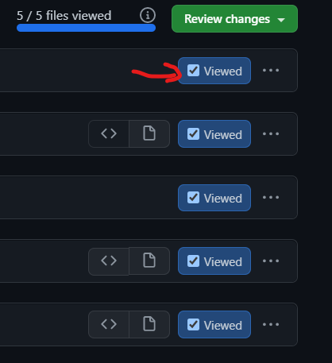

:::tip

Puedes ver el archivo como código o como se vería el markdown usando este toggle.

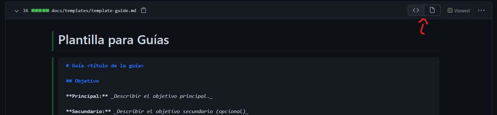

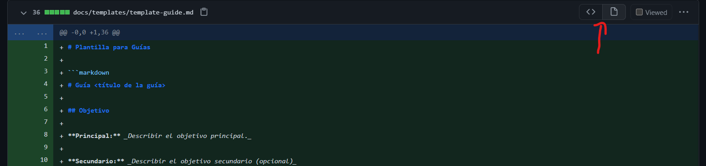

:::

:::note

No todos los archivos se podrán ver o tendrán cambios que requieran revisión. Aún así la recomendación es marcarlos como viewed.

:::

6. Cuando hayas terminado tu revisión, haz clic en **Review changes**, deja algún comentario general de tu revisión, selecciona el tipo de revisión que quieres dejar y da clic en **Submit review**.

    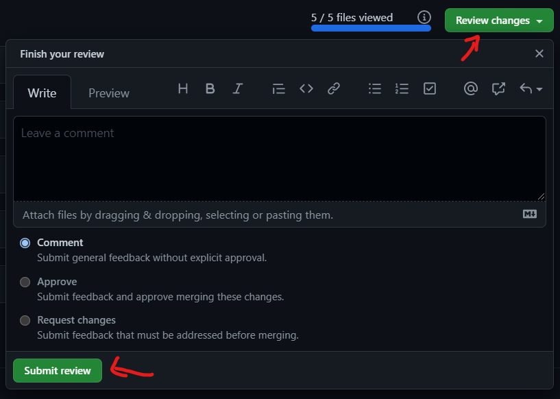

:::note

Si durante tu revisión realizaste modificaciones y se hicieron commits a la rama, el comentario general debería incluir lo siguiente:

- La liga al preview del asset con tus modificaciones.

- Las imágenes de cómo se vería tu modificación al hacer deploy si es algo que sólo se ve en Docusaurus.

:::

7. Tu revisión debería salir en el tab **Conversation** del pull request.

    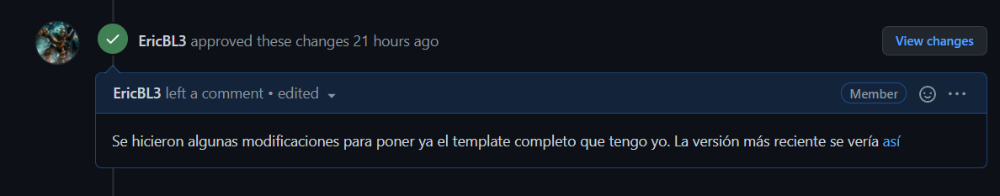

### Cómo hacer comentarios para un archivo

1. Dar clic en el botón **+** en la línea en la que quieras dejar el comentario.

   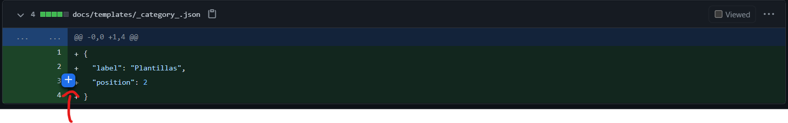

2. Escribe tu comentario y da clic en **Add review comment**.

    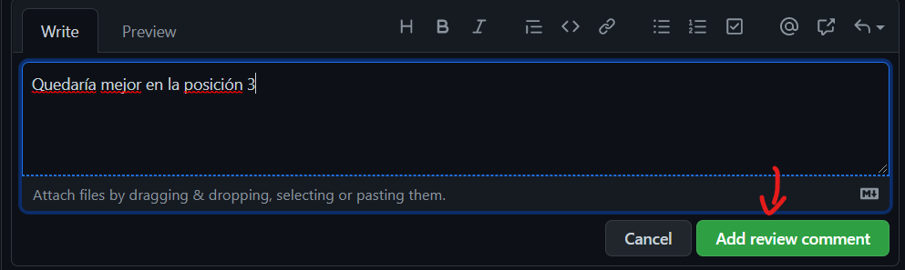

3. Tu comentario se verá así.

    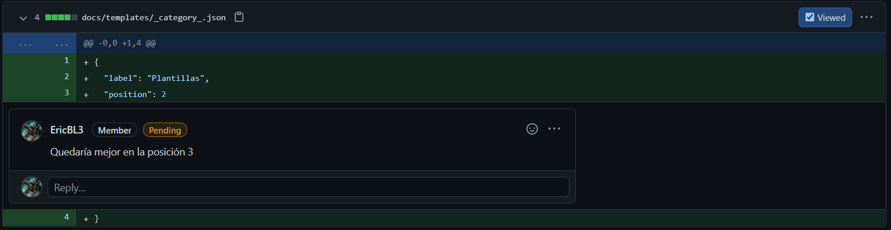

### Cómo hacer modificaciones de un archivo

1. Dar clic en **...** y luego en ***Edit file*** en el archivo que quieras modificar.

    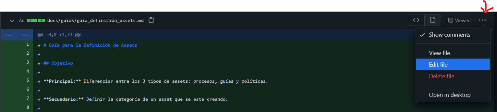

2. Realiza los cambios que consideres necesarios usando la pestaña preview como ayuda para revisarlos.

3. Realiza el commit de tus cambios usando la estructura de la siguiente imagen. Asegurate de seleccionar la opción para hacer el commit en la misma rama del pull request.

    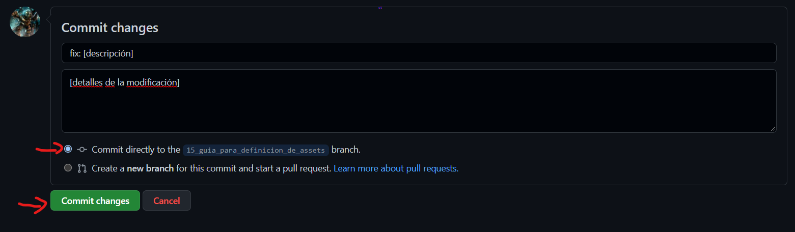

4. El commit debería salir en el tab **Conversation** del pull request.

    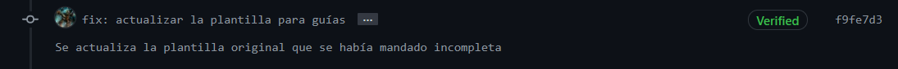

## Salidas

- El resultado de la revisión en la conversación del pull request del asset.

## Autores

- Eric Buitrón López

## Auditoría

- 