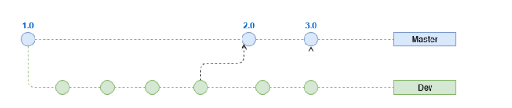
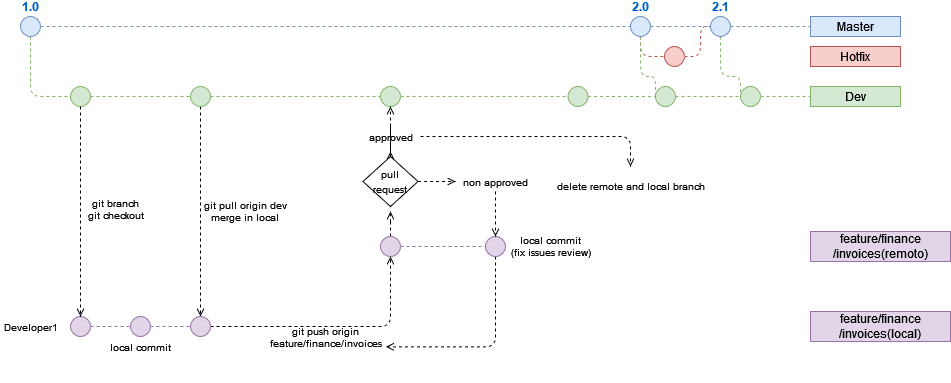

# G11 - Guía para manejo de ramas

## Objetivo(s)

Guiar sobre el uso de control de versiones 

## Pre-requisitos

Tener git instalado

Haber clonado los repositorios base:
- 
<a href="https://github.com/Taro-IT/docs"> Línea base del departamento</a>

- 
<a href="https://github.com/Taro-IT/Espresso"> Línea base de Espresso</a>

- 
<a href="https://github.com/Taro-IT/frappe"> Línea base de Frappe</a>

## Ramas Permanentes

Las ramas permanentes son las líneas de código sobre las que se derivan las demás ramas. Estas nunca dejan de existir y se integran continuamente.

### Master

En esta rama sólo existe código que está listo para desplegarse en producción, es la versión estable de los proyectos y que contiene una solución utilizable.

Dicha rama ha pasado todo el cluster de pruebas y además las reviews de los pull request. 

El merge de dev a master se realiza a través de un pull request. El único caso en donde se puede realizar un push directo a master es en el caso de un hotfix, pero deberá ser aprobado por ambos Architecture Owners y debidamente justificado.

### Dev

La rama de dev contiene las features más recientes, cuando dichas features agreguen valor y son capaces de mostrarse en una demo se despliegan a la rama de master a través de un pull request.

Esta rama es a partir de la cual se crean las diferentes ramas locales para trabajar, es la rama dinámica sobre la que se implementan los cambios.
## Ramas Temporales

Las ramas temporales son las ramas en las que se trabaja de forma local. Dichas ramas proceden siempre de la rama permanente Dev. La convención para nombrarlas es: 

`[Prefijo]/[Contexto/Epic]/[Nombre del item de trabajo]`.

La siguiente tabla explica los prefijos aceptados actualmente.

| Prefijo | Descripción | Ejemplo |
| ------- | ----------- | ------- |
| setup   | Esta rama es utilizada para hacer modificaciones al **ambiente de desarrollo.**| `setup/django/cambio-json-file` |
| feature | Esta rama es utilizada para el **desarrollo** de las _user stories_ o _features_ de la aplicación. **Es importante poner el nombre o id de la user story para identificar el propósito de la rama**. | `feature/users/login_facebook` |
| fix     | Esta rama es utilizada para **arreglar errores** en el código que rompen la aplicación. Por ejemplo:  devuelve un error 404 cuando debería regresar un error 500. | `fix/users/login_facebook` |
| refactor    | Esta rama es utilizada para **cambiar y mejorar la lógica** utilizada en un _feature_. Generalmente estos cambios son necesarios después de la _validación de usabilidad_ con el cliente. | `refactor/users/login_facebook`
| docs    | Esta rama es utilizada para la subida o modificación de **documentos** en el repositorio. | `docs/G13-guia-para.manejo-de-ramas`

## Forma de trabajo

Para poder comenzar a desarrollar de forma local es necesario seguir los siguientes pasos

- Clonar el repositorio base sobre el que se va a trabajar, los cuales pueden ser:

    - 
<a href="https://github.com/Taro-IT/docs"> Línea base del departamento</a>

    - 
<a href="https://github.com/Taro-IT/Espresso"> Línea base de Espresso</a>

    - 
<a href="https://github.com/Taro-IT/frappe"> Línea base de Frappe</a>

- Crear de forma local la rama Dev y sincronizarla con la rama Dev remota
<pre><code>git branch dev  
git checkout dev
git pull origin dev</code></pre>

- Crear la rama local de trabajo siguiendo el sistema de Ramas Temporales y moverse a ella

<pre><code>git branch feature/finance/invoice-payments  
git checkout feature/finance/invoice-payments 
</code></pre>

- En este punto se ubicará sobre la rama local de desarrollo, por lo que se pueden agregar todos los commits que sean necesarios

<pre><code>git add -A  
git commit -m "Se agregaron funcionades relacionadas a la validación de facturas" 
</code></pre>

- Una vez que se haya terminado el trabajo y sea necesario subir los cambios a la rama de dev, se resolverá cualquier conflicto de forma local: 

<pre><code>git pull merge dev 
</code></pre>

- Despues de resolver los conflictos que se tuvieran con la rama dev se enviara nuestra rama de trabajo local al repositorio remoto para solicitar el pull request hacia dev. 
    
<pre><code>git push origin feature/finance/invoice-payments 
</code></pre>    

- Una vez aprobado el pull request se debe de eliminar la rama local sobre la que se estuvo trabajando, en caso de que se soliciten cambios se deben de implementar y volver a agregar los commits necesarios para resolverlos.

## Autores
- Juan Manuel Amador Perez Flores

## Auditoría
- Adolfo Acosta Castro

## Versión 1.0
