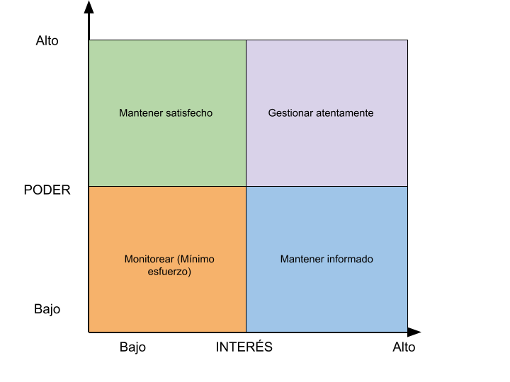
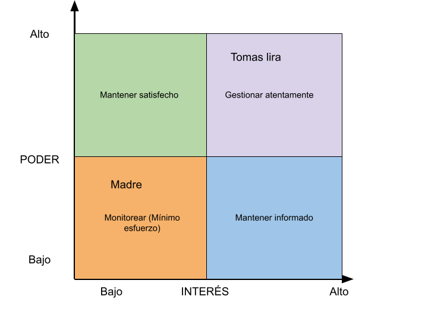

# G15 - Guía para realizar un plan de comunicación con los interesados.

## Objetivo(s)

- Realizar un plan de comunicación con los interesados, para definir las formas en la cual ocurrirá dicha comunicación.

## Prerrequisito(s)

- Una matriz de interesados vacía.

## Pasos a seguir

Utilizando la plantilla del [plan de comunicación](../plantillas/PL16-plantilla-para-plan-comunicacion) se deberá de realizar lo siguiente:

### Identificar a los interesados en la matriz

Un interesado, también llamado stakeholder, son personas o entidades que tienen algún tipo de interés en el proyecto y que pueden afectar o ser afectadas por este. Este paso involucra:

- Identificar a los interesados en el plan.
- Identificar a los interesados en la siguiente matriz de interesados, con respecto al poder e interés que estos tienen sobre el plan.

- Poner los nombres de cada interesado en el lugar que corresponda dentro de la matriz, por ejemplo:

### Desarrollar las formas de comunicación

Por cada interesado hay que detallar todas las formas de comunicación que se tendrá, esto involucra:

- Listar todas las herramientas de comunicación que se tendrá con el interesado.
- Por cada herramienta, listar todos los canales que existen y su propósito, si aplica.
- Por cada herramienta, listar la forma en la que la comunicación tiene lugar, como puede ser las menciones y reacciones, si aplica.
- Definir los horarios en los cuales es posible comunicarse con los interesados.

## Salidas

- Plan de comunicación.

## Autores

- Raúl Rosario Galaviz
- Saul Axel Palacios Acosta

## Auditoría

- María de los Ángeles Contreras Anaya
- Adolfo Acosta Castro

## Bitácora de cambios

### Versión 1.1

- Se cambió el propósito de la guía para realizar un plan de comunicación.
- Se arregló el formato.

### Versión 1.0

- Se creó la guía.
