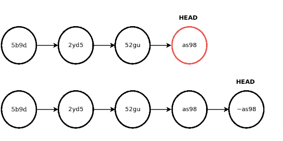
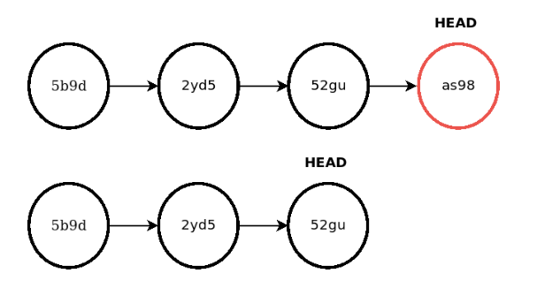
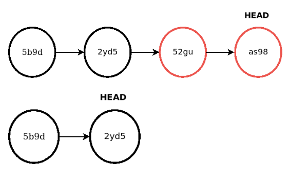

# G17 - Guía de reversión de código

## Objetivo(s)

- Definir como revertir el código en caso de ser necesario usando la herramienta definida para el control de versiones de código (Git).

## Prerrequisito(s)

- Estar en la rama a revertir.

## Comandos Git para la reversión

### git reverse

El comando `git reverse` revierte el proyecto al estado de un commit, esto lo hace generando un nuevo commit que revierte los cambios realizados. De esta manera las modificaciones **no son eliminadas del historial** y pueden ser accedidas en el futuro, eso sí, los cambios locales que no han sido guardados serán sobrescritos.

Para hacer `git reverse` sobre el último commit:

    git reverse HEAD~1

O sobre un commit en específico haciendo uso del ID del dicho commit.

    git reverse 52gu

:::tip

Para identificar el ID de un commit en específico puedes utilizar el comando `git log` que permite ver los commits locales o `git log origin (<branch_name>)` para ver los commits de una rama remota en específico.

:::

#### Utilizar `git reverse` cuando:

- Se han hecho publicaciones que quieren revertirse pero que se desean mantener en el historial.

### git reset

El comando `git reset` se utiliza para mover el proyecto a un commit anterior eliminando todos los commits posteriores a este del historial.

Para hacer `git reset` sobre el último commit:

    git reset HEAD~1

O sobre un commit en específico haciendo uso del ID de dicho commit.

    git reset 2yd5

`git reset` puede utilizarse con dos opciones:

    git reset --soft [<commit_id>]

Genera un reset de HEAD hacia otro commit, pero no modifica el índice de archivos ni el contenido local. Esto significa que los archivos agregados o eliminados y los cambios producidos durante estos commits reseteados se mantendrán en el contenido local.

    git reset --hard [<commit>]

Modifica el HEAD, el índice de archivos y el contenido local. El estado del proyecto es el equivalente al que se encontraba en el commit al que fue reseteado.

Puede utilizarse `git reset` cuando:

- Se han hecho commits equivocados de manera local y se quieren deshacer dichos cambios

  - Usar `git reset --hard` si no se quiere mantener ningún cambio local.
  - Usar `git reset --soft` si se quieren mantener los cambios locales para hacerles commit en otro momento.

- Se ha publicado información sensible o que simplemente se desea eliminar del historial.

:::note

Si se está trabajando de manera grupal, se deberá llegar a un consenso antes de utilizar `git reset` para evitar conflictos.

:::

## Salidas

- La rama revertida a un punto anterior.

## Autores

- Juan Manuel Amador Pérez Flores

## Auditoría

- Adolfo Acosta Castro

## Bitácora de cambios

### Versión 2.0

- El asset ha sido institucionalizado.

### Versión 1.1

- Se eliminan algunos párrafos para evitar ser repetitivos.
- Se incluye como revisar el ID de un commit en GitHub.
- Se agrega "git reset" en un párrafo.

### Versión 1.0

- Se creó el proceso.
