# G18 - Guía para realizar un pull request

## Objetivo(s)

* Solicitar la revisión y el merge de nuevas funcionalidades para validar que este sigue los estandares de calidad.

## Pre-requisitos

* Contar con item de trabajo nuevo o fix de trabajo. (Revisión de codigo, nuevo feature, fix de un feature, etc. ). Siguiendo la [guia de manejo de ramas](https://taro-it.github.io/docs/guias/G12-guia-para-manejo-de-ramas).

## Pasos a seguir

### Entrar al [repositorio](https://github.com/Taro-IT/docs) del equipo:

* Navegar a Pull Request
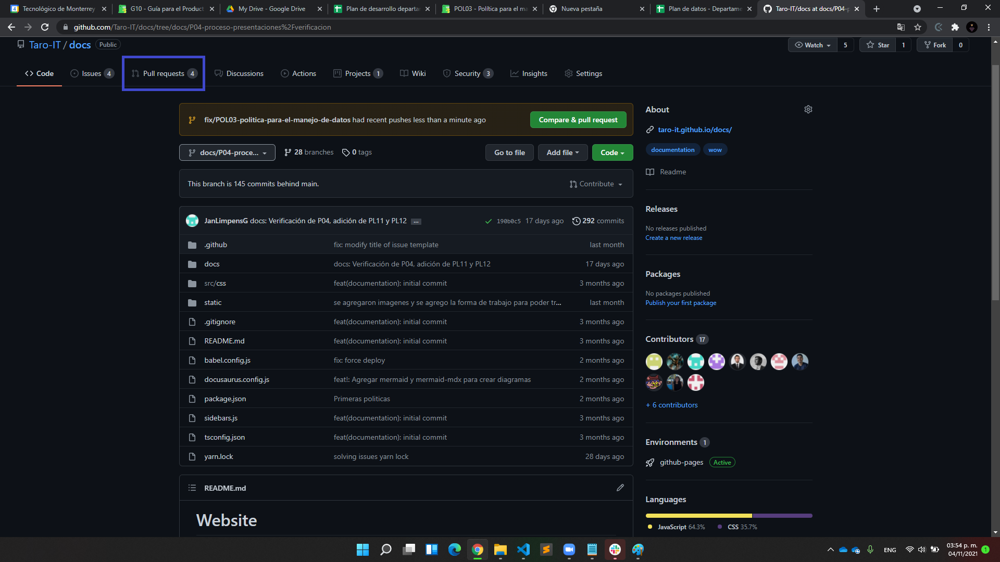

* Navegar a new Pull Request
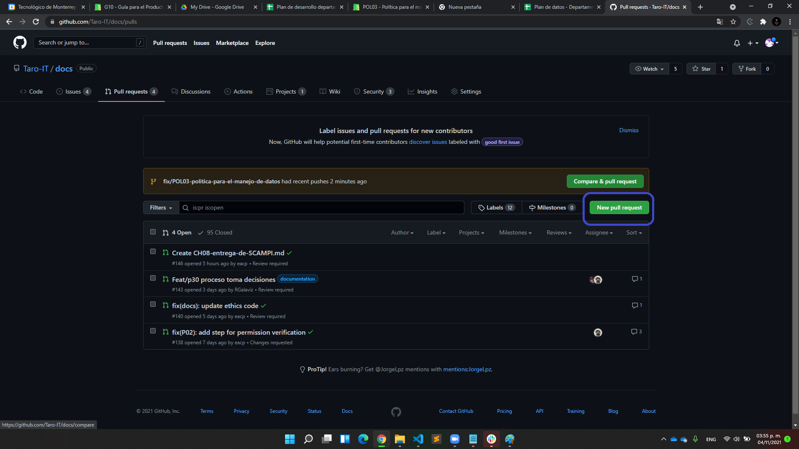

* Localizar la rama a realizar merge y hacer click en la rama a solicitar pull request.
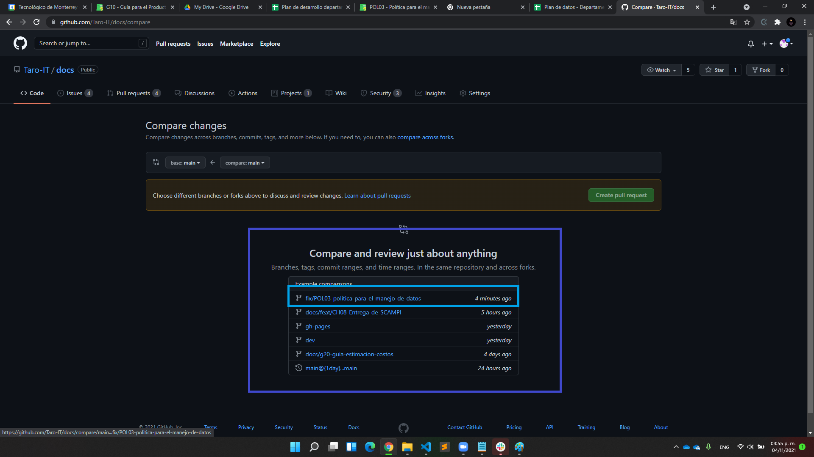

* Navegar a create Pull Request
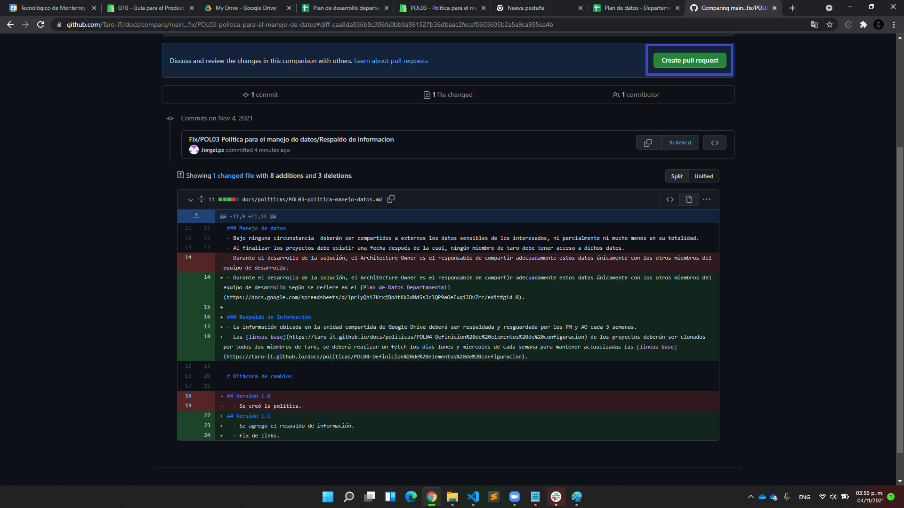

* Localizar y agregar a los miembros de equipo para realizar la auditoría.
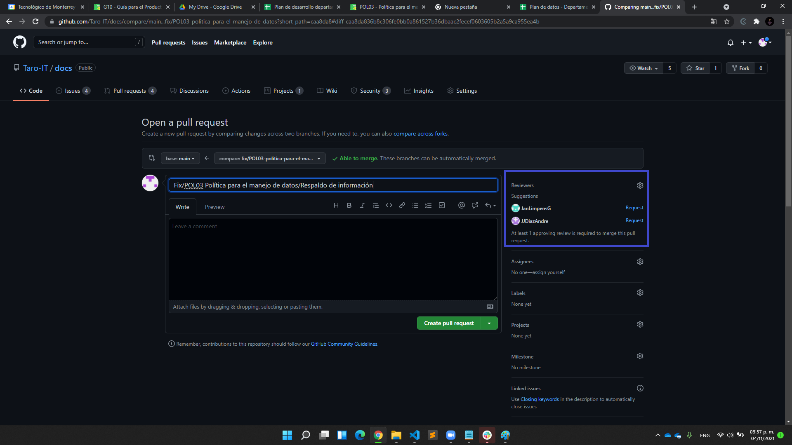
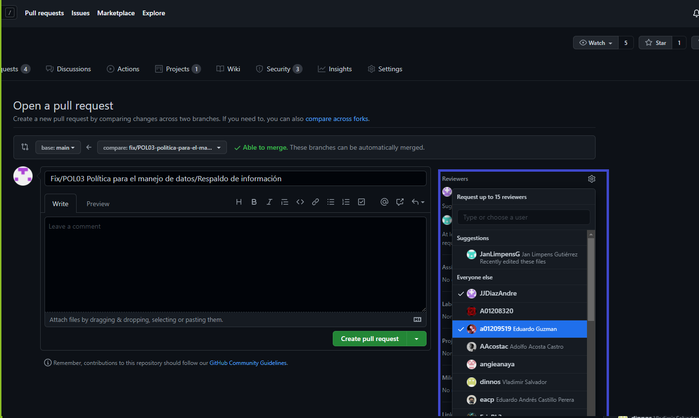

* Escribir un comentario (Opcional) y posteriormente navegar a create pull request.
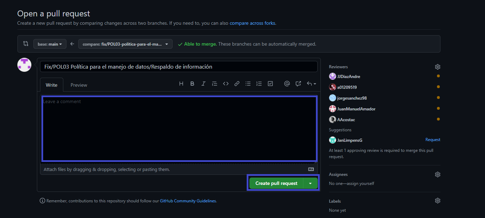

### Para realizar el merge del pull request
* Navegar a pull request

* Elegir el pull request a auditar.
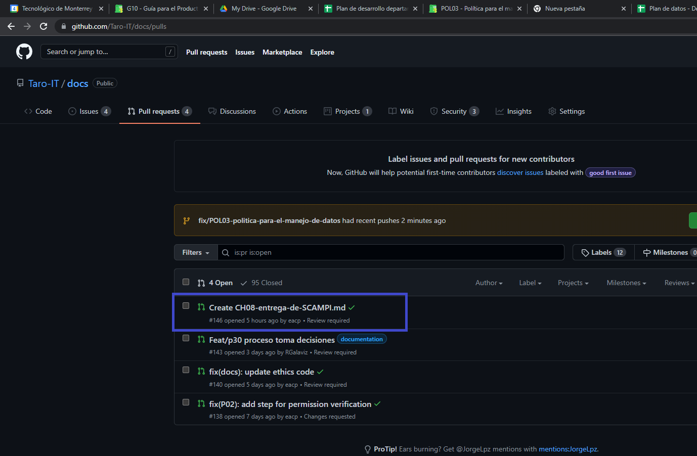

* Navegar a add you review
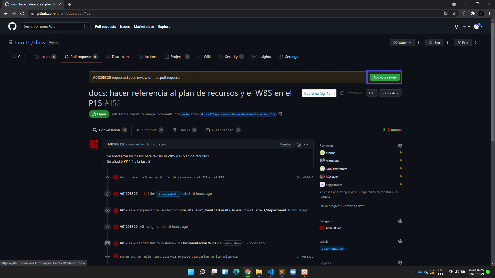

* Navegar a review changes y seleccionar la opción correspondiente.
* Approve : Verificaste y no hay ningún problema con el merge.
* Request Changes: Verificaste pero aún no esta bien definido.
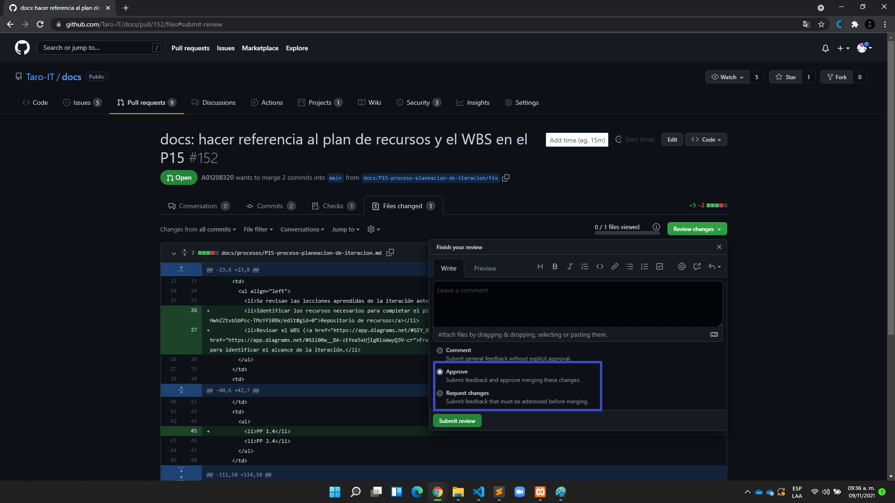

* Si tu pull request ya ha sido aprobado por los auditores, entonces se desplegaá la siguiente ventana dentro de tu pull request.
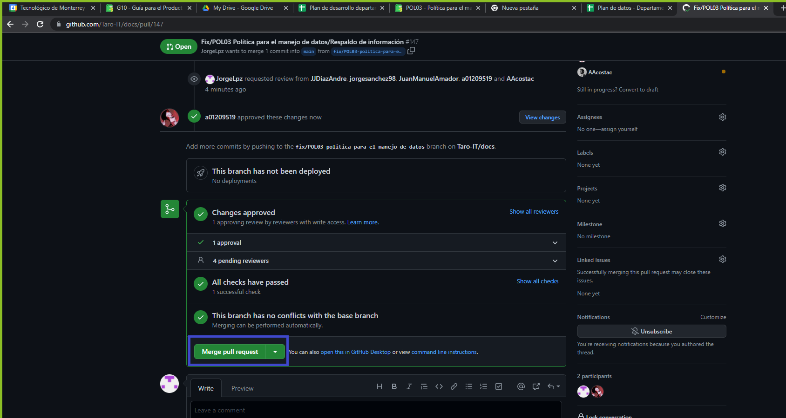

## Salidas
* Versión nueva del [repositorio](https://github.com/Taro-IT/docs)
* Registro en la bitácora de actualización si un archivo fue actualizado o creado

## Autores
Jorge López Chávez

## Auditoría

# Bitácora de cambios

## Versión 1.0
  - Se creó la guía.
