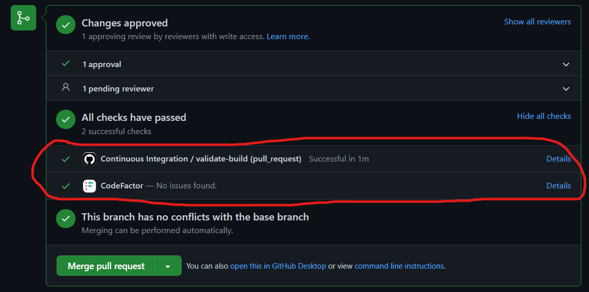
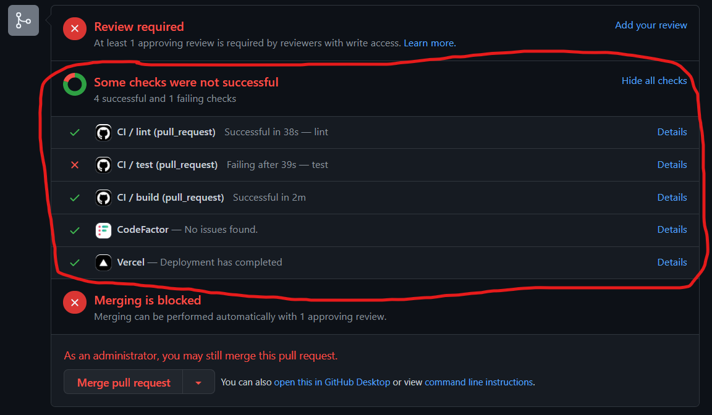

# G18 - Guía para realizar un pull request

## Objetivo(s)

- Solicitar la revisión y el merge de nuevas funcionalidades para validar que este sigue los estándares de calidad.

## Prerrequisito(s)

- Contar con work item nuevo o correcciones a un work item, siguiendo la [guía de manejo de ramas](https://taro-it.github.io/docs/guias/G12-guia-para-manejo-de-ramas).
- Acceso al repositorio correspondiente ([Taro](https://github.com/Taro-IT/docs), [Espresso](https://github.com/Taro-IT/Espresso), [Frappé](https://github.com/Taro-IT/frappe)).

## Pasos a seguir

### Entrar al repositorio correspondiente:

- Navegar a "Pull requests"
  

- Dar clic en "New pull request"
  

- Localizar la rama a realizar merge en el dropdown "compare" y dar clic en la rama a solicitar el pull request.
  

- Dar clic en "Create pull request"
  

- En la sección de "Reviewers" localizar y agregar a los integrantes que deben realizar la auditoría.
  
  

- Escribir un comentario (Opcional) y posteriormente navegar a create pull request.
  

### Para realizar el merge del pull request

- Navegar a pull request
  

- Elegir el pull request a auditar.
  

- Navegar a add you review
  

- Navegar a review changes y seleccionar la opción correspondiente.

  - Approve : Verificaste y no hay ningún problema con el merge.
  - Request Changes: Verificaste pero aún no esta bien definido.
    

- Si tu pull request ya ha sido aprobado por los auditores, entonces se desplegará la siguiente ventana dentro de tu pull request.
  

:::note

Todos los pull requests pasan por una verificación automática de _integración continua (CI)_. Para poder aprobarlos deben haber pasado exitosamente estas verificaciones.

Así se ve cuando pasaron todas las verificaciones de CI:

Así se ve cuando no pasaron todas las verificaciones de CI:

:::

## Salidas

- Versión nueva del repositorio.

## Autores

- Jorge López Chávez

## Auditoría

- Jan Limpens Gutierrez

## Bitácora de cambios

### Versión 1.1

- Se agrega la nota de la verificación de CI.

### Versión 1.0

- Se creó la guía.
