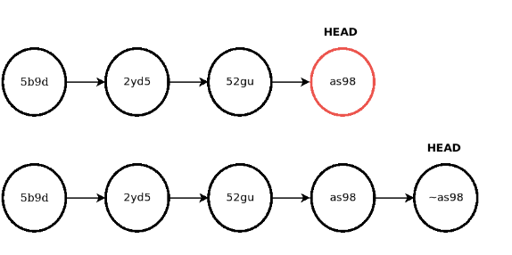
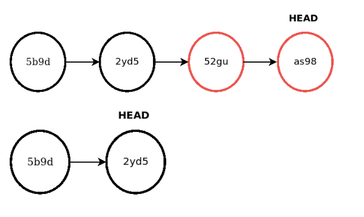

# G18 - Guía de reversión de código

## Objetivo(s)

- Definir como revertir el código en caso de ser necesario usando la herramienta definida para el control de versiones de código (Git).

## Pre-requisitos

- Estar en la rama a revertir 

## Pasos a seguir

### git reverse

El comando `git reverse` revierte el proyecto al estado de un commit **generando un nuevo commit** que revierte los cambios realizados. De esta manera las modificaciones **no son eliminadas del historial** y pueden ser accedidas en el futuro. Los cambios locales que no han sido guardados son sobrescritos.

Para hacer `git reverse` sobre el último commit:

    git reverse HEAD~1

O haciendo referencia al ID del commit.

    git reverse 52gu

Puede utilizarse `git reverse` cuando:

- Se han hecho publicaciones que quieren revertirse pero desean mantenerse en el historial.

NO debe utilizarse reverse cuando:

- Se han publicado modificaciones que contienen información sensible que no quiere ser registrada en el historial.
Se han publicado archivos que quieren eliminarse permanentemente del historial.

### git reset 

El comando `git reset` se utiliza para mover el proyecto a un commit anterior eliminando todos los commits posteriores del historial. 

Para hacer `git reset` sobre el último commit:

    git reset HEAD~1

O haciendo referencia al ID del commit.

    git reset 52gu

Para hacer `git reset` sobre los últimos dos commits

    git reset HEAD~2

O haciendo referencia al ID del commit.

    git reset 2yd5

`git reset` puede utilizarse con dos opciones:

    git reset --soft [<commit>]

Genera un reset de HEAD hacia otro commit. No modifica el índice de archivos ni el contenido local. Esto significa que los archivos agregados o eliminados y los cambios producidos durante estos commits reseteados se mantendrán en el contenido local.

    git reset --hard [<commit>]

Modifica el HEAD, el índice de archivos y el contenido local. El estado del proyecto es el equivalente al que se encontraba en el commit al que fue reseteado.

Puede utilizarse reset cuando:

- Se han hecho commits equivocados no publicados y se desea deshacer los cambios: En el caso de no querer mantener ningunos de los cambios locales realizados puede utilizarse la bandera `--hard`, en caso contrario, si se quieren mantener esos cambios para realizar un commit con ellos más adelante puede utilizarse la bandera `--soft`.
- Se han publicado commits cuya información se desea eliminar del historial permanentemente.

NO debe utilizarse `git reset` cuando:

- Se quiere regresar el proyecto al estado de un estado anterior pero se quiere mantener registros de esos cambios. En este caso debe utilizarse el comando `git reverse`.
- Se está trabajando en proyecto entre más de una persona y no existen un consenso grupal sobre el revertido permanente.

## Salidas

- La rama revertida a un punto anterior 

## Autores

- Juan Manuel Amador Perez Flores 

## Auditoría
- Adolfo Acosta Castro

## Versión 1.0
- Se creó el proceso.