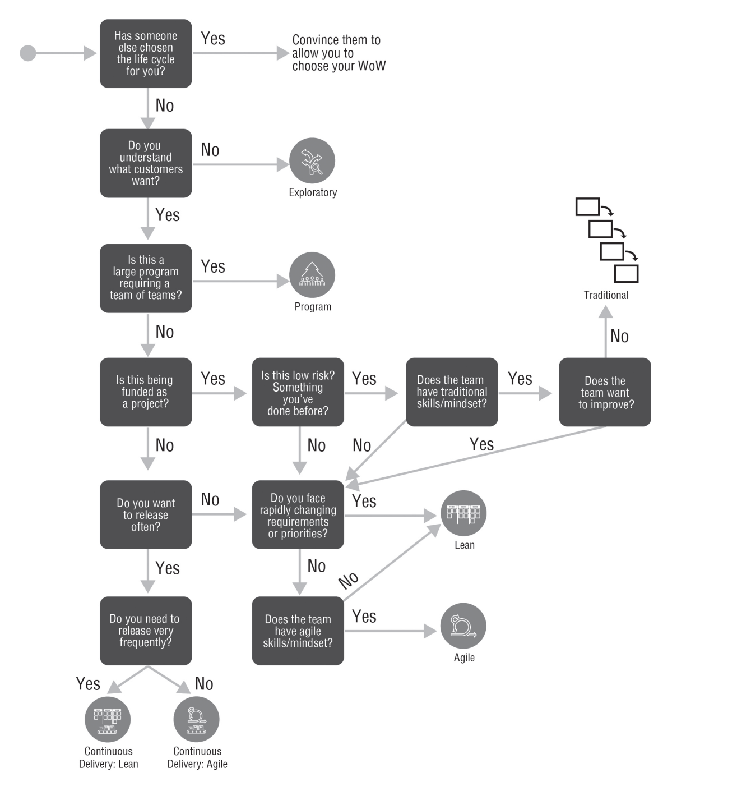

# G25 - Guía para escoger un ciclo de vida

## Objetivo(s)

- Escoger uno de los ciclos de vida de entrega de soluciones que ofrece DAD para un proyecto.

## Pre-requisitos

- Proyecto de desarrollo nuevo

## ¿Qué es un ciclo de vida?
Un ciclo de vida de entrega de soluciones en un proyecto de software es un marco de referencia que describe el proceso que se sigue para producir una solución de forma sistemática y con un alto nivel de calidad. Cada ciclo de vida en general comprende las siguientes etapas:

- **Incepción**: se invierte suficiente tiempo para formar y organizar al equipo, explorar los requisitos y arquitectura iniciales, hacer un plan inicial y desarrollar una visión en común con los stakeholders.

- **Construcción**: se produce una solución consumible y de valor para los socios, se colabora de forma cercana con los stakeholder para entender sus necesidades, construir una solución, obtener su retroalimentación, y atender esa retroalimentación regularmente. Se realizan actividades de análisis, diseño y codificación continuamente.

- **Transición**: se lanza una solución consumible a su ambiente de producción y se prepara a los usuarios afectados por ella para su uso exitoso.

## ¿Qué opciones ciclos de vida existen?
En Taro utilizamos para nuestros proyectos los ciclos de vida de Disciplined Agile Delivery, los cuales se resumen a continuación. Checa las referencias incluidas en esta guía para encontrar más información sobre los ciclos de vida de DAD.

### Agile
Se producen soluciones consumibles traves de iteraciones cortas, también conocidas como sprints. Está basado en Scrum.

### Continuous Delivery Agile
Es una evolución de Agile, se trabaja en iteraciones muy cortas y al final de cada una de ellas se despliega la solución a producción gracias a prácticas de CI/CD.

### Lean
Se basa en Kanban, en Lean el equipo prioriza tareas y toma tareas cada vez que es necesario y de forma continua. No hay iteraciones en este ciclo de vida y se toman tareas una a la vez de acuerdo con la capacidad del equipo.

### Continuous Delivery Lean
Es una evolución de Lean en la que los equipos despliegan su trabajo a producción con tanta frecuencia como sea posible, usualmente varias veces al día.

### Exploratorio
Se explora una idea desarrollando uno o varios Mininum Viable Products y realizando experimentos para determinar si dan solución a la necesidad abordada. 

### Programa
Se utiliza cuando se manejan un equipo grande que está organizado como un equipo de equipos.

## ¿Como se escoge el ciclo de vida para un proyecto?

Para escoger un ciclo de vida se debe entender el contexto único del proyecto a punto de realizarse. Algunos de los factores mas importantes a tener en cuenta son: 
- Las habilidades y disciplina del equipo
- La cultura y flexibilidad del equipo
- La naturaleza del problema y su facilidad para ser descompuesto en incrementos

El siguiente diagrama de decisiones indica algunas principales consideraciones para escoger un ciclo de vida:

## Referencia
- Ambler, S. W., Lines, M., &amp; Smart, J. (2019). Chapter 6: Choosing the Right Life Cycle. En Choose your wow!: A Disciplined Agile Delivery Handbook for Optimizing Your Way of working. essay, Disciplined Agile Consortium. 
- Full delivery life cycles. Disciplined agile (DA) - Project Management Institute. Recuperado de: https://www.pmi.org/disciplined-agile/lifecycle#Choosing

## Salidas

- Elección de ciclo de vida

## Autores

- Adolfo Acosta Castro

## Auditoría

_Enlistar a las personas que revisaron la guía_

- 

## Bitácora de cambios
- La versión actual debe ser la que quede hasta arriba de esta sección

### Versión 1.0
- Se creo la guía