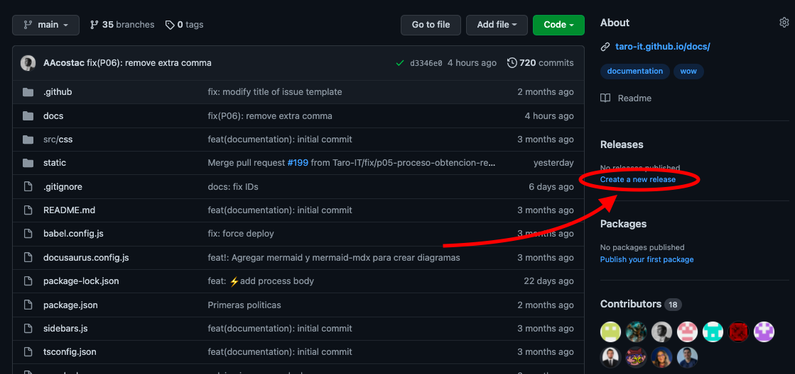
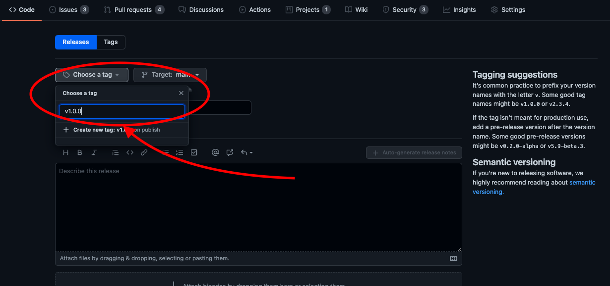
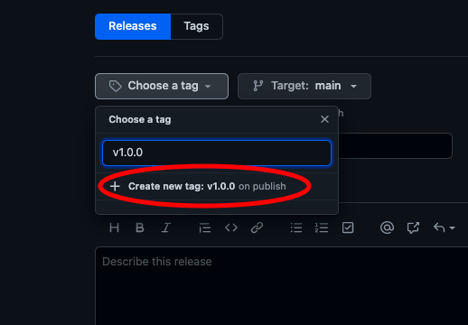
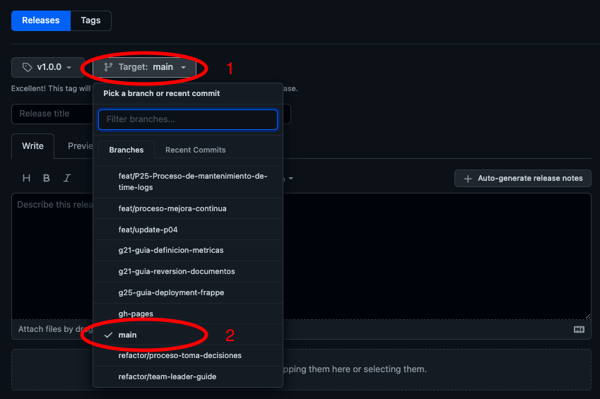
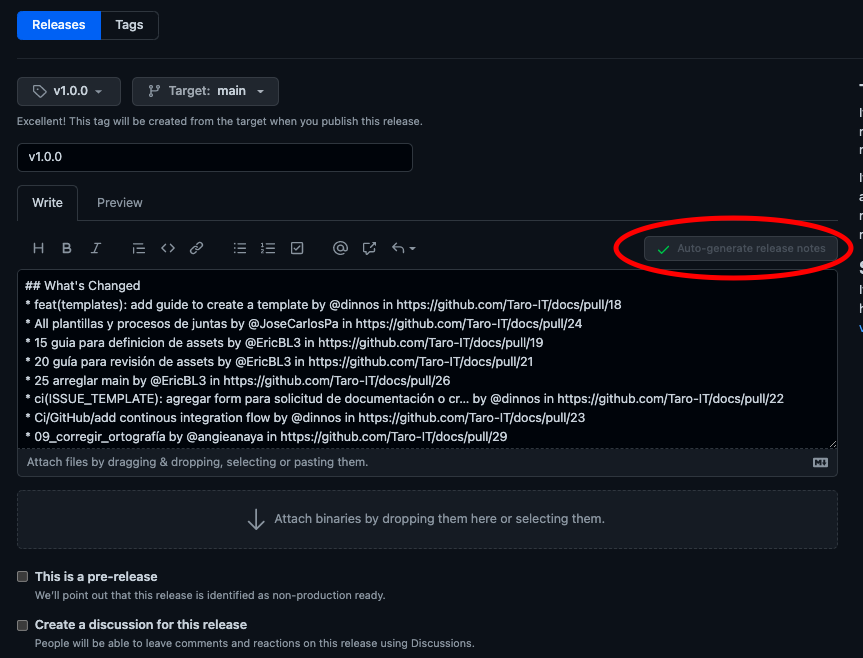
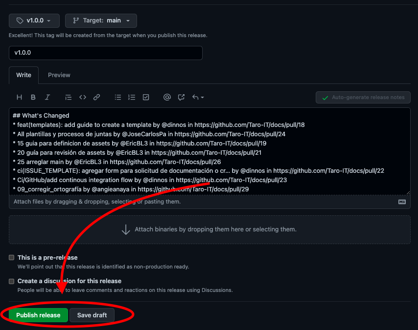
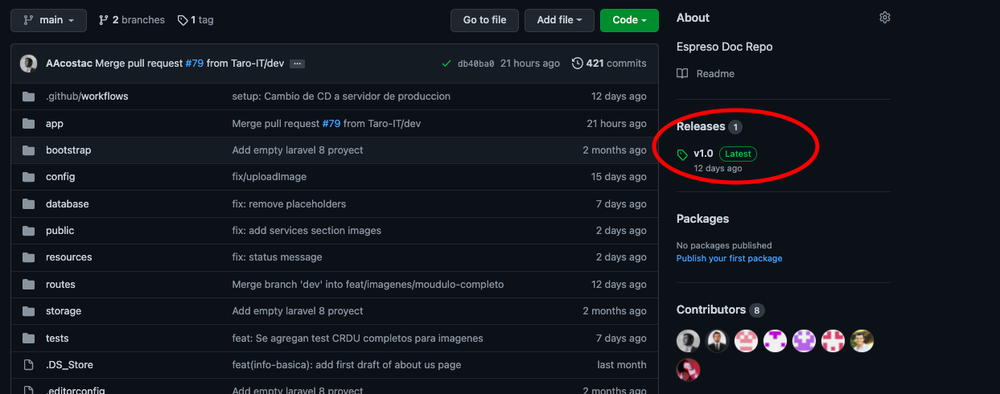

# G27 - Guía de release de la wiki

## Objetivo(s)

- Orientar en la toma de decisión de cuando hacer un release de la wiki. 
- Dar a conocer los pasos necesarios para realizar un release de la wiki.

## Pre-requisitos

- Todas las políticas, procesos y guías deben de tener el estado _controlado_ o _estático_ dentro de la [matriz de configuración](https://docs.google.com/spreadsheets/d/13zfQpqBBmqAT_znf1N4ebV_jcLBpeh_gjq9eHpkdOhk/edit?usp=sharing "matriz de configuración") que corresponda. 

## ¿Cuándo hacer un realise de la wiki?
Un release de la wiki se debe de hacer cuando se cumpla **una** de las siguientes condiciones:
- Se va a tener una revisión SCAMPI en los próximos días.
- Se va a hacer una presentación de avance en los próximos días.

## Pasos a seguir

1. Hacer merge de dev a main del proyecto que se quiere hacer el release.

2. Entrar a [Taro-IT/docs](https://github.com/Taro-IT/docs "Taro-IT/docs"), [Taro-IT/Espresso_doc](https://github.com/Taro-IT/Espresso_doc "Taro-IT/Espresso_doc") ó [Taro-IT/frappe](https://github.com/Taro-IT/frappe "Taro-IT/frappe") y dar clic en **Create a new release**.

3. Dar clic en **choose a tag** y escribir la versión del release siguiendo la [guía de manejo de configuración](./G11-guia-manejo-de-configuracion).

4. Dar clic en **create a new tag**.

5. Seleccionar la rama de la que se quiere hacer un release.

6. Escribir o generar las notas del release.

7. Dar clic en **Publish release** si se quiere publicar el release ó S**ave draft** si se quiere trabajar luego. 

8. Si se dió clic en **Publish release** ya se puede ver el release en el feed de releases de Github. 

## Salidas

- Release de la wiki.

## Autores

- Eduardo Guzmán de la Concha

## Auditoría
-
## Bitácora de cambios

### Versión 1.0
- Se creó la guía.