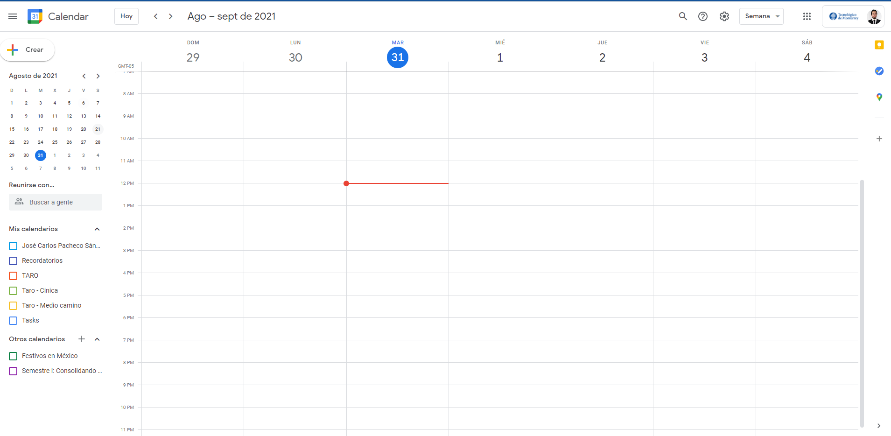
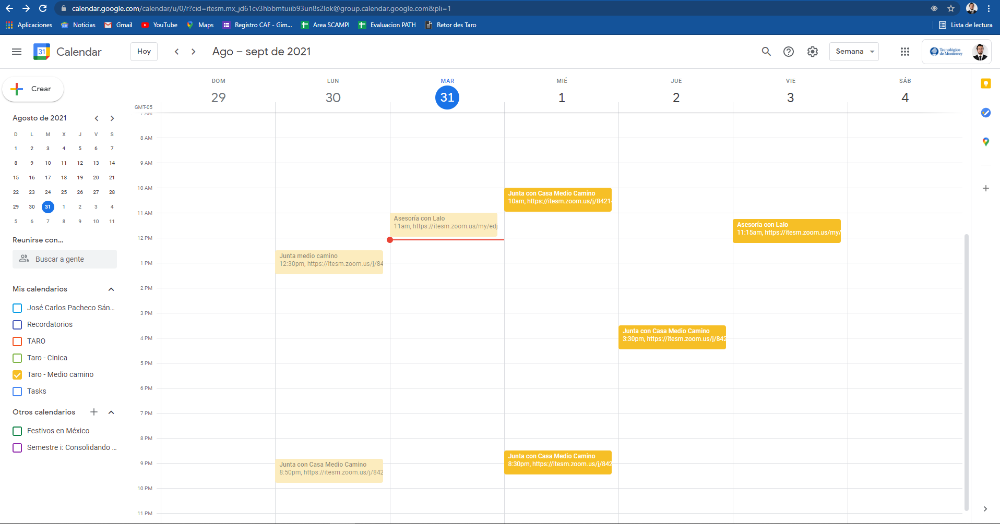
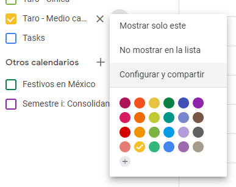
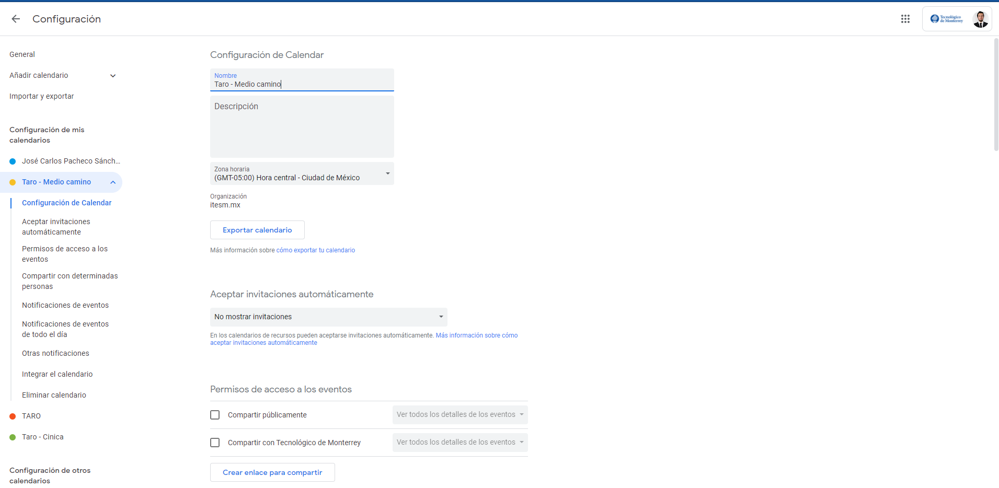
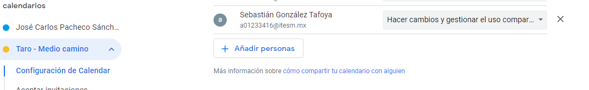
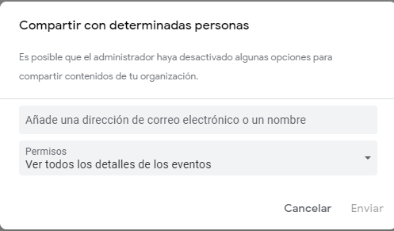

**Propuesta para Guía para agendar eventos**

## Objetivo
**Principal:** Orientar en la creación y toma de decisión de fechas de un evento departamental dentro del calendario oficial y recreativo de Taro, esto incluye los calendarios:

<ul><li>Académicos (semestre i)</li><li>Departamentales</li><li>Equipos correspondientes</li></ul>

**Secundario:** Organizar de manera visual y ordenada todos los eventos para mejorar la organización y planeación personal de cada integrante del departamento, permitiendo su mayor participación en todos los eventos.

## Pre-requisitos

Contar con las plantilla:
- Contar con acceso al calendario virtual [Académico (Semestre i)](https://calendar.google.com/calendar/embed?src=itesm.mx_jd61cv3hbbmtuiib93un8s2lok%40group.calendar.google.com&ctz=America%2FMexico_City)
- Contar con acceso al calendario virtual [Departamental](https://calendar.google.com/calendar/embed?src=c_fprk5lfepv1dslipu1dv1let2c%40group.calendar.google.com&ctz=America%2FMexico_City)
- Contar con acceso al calendario virtual por Equipos ( [Frappé](url) o [Espresso](url) )

Nota: _En caso de no contar con acceso a los calendarios se deberá  seguir lo siguientes pasos:, de lo contrario puede pasar a la sección "Norma para los eventos"_

## Pedir acceso al calendario Virtual
En caso de no contar con acceso al calendario puedes seguir estos pasos para obtener tu acceso

<ol>
<li> Ingresa a Google Calendar: Veras una pantalla parecida a esta</li>

<li>Selecciona el Calendario que deseas compartir, te aparecerá una palomita y el calendario se llenara con los eventos actuales</li>

<li>Dar clic en los tres puntitos, aparecerá el siguiente menú desplegable, donde tendrás que dar clic en "Configurar y compartir"</li>

<li>Aparecerá la siguiente pantalla, aquí podrás editar y configurar todos los aspectos del calendario</li>

<li>Deberás buscar el siguiente botón con nombre "Añadir Persona"</li>

<li>Ahi, seleccionaras y escribirás el correo al cual quieres que le llegue y los permisos que se le otorgaran ya sean solo de vista de espacios libres, vista general, edición de eventos y edición de eventos + uso compartido   </li>

</ol>

## Norma para los eventos

- Se deberá poner un titulo descriptivo con la razón objetivo de l evento
- Se especificara la fecha y rango de horas para el evento
- En caso de contar con los correos de los participantes agregarlo para poder enviar una invitación de manera automática
- En caso de usar una sala de virtual se deberá  verificar la disponibilidad de los links:
<ol><li>Taro General - https://itesm.zoom.us/j/84214225212 </li><li>Frappe -  https://itesm.zoom.us/u/kbyD5xduhs  </li><li>Espresso - 
 https://itesm.zoom.us/u/kkbD8ViPL  </li></ol>

- Agregar una descripción y los puntos claves a tocar en ese evento en la sección "Descripción"
- Seleccionar el Calendario virtual en el que se colocara, ya sea Taro, Cínica o Medio Camino
- Opcionalmente se puede agregar una notificación de recordatorio

## Autores

- Jose Carlos Pacheco Sánchez

## Auditoría

-  Karla Romero
 

